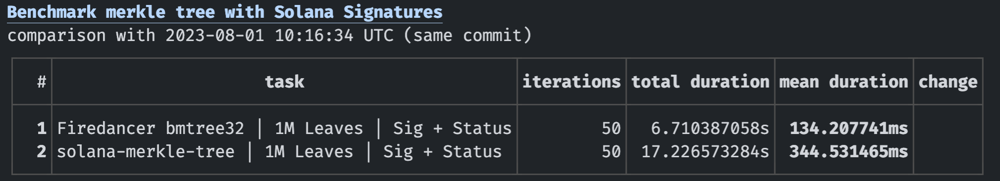
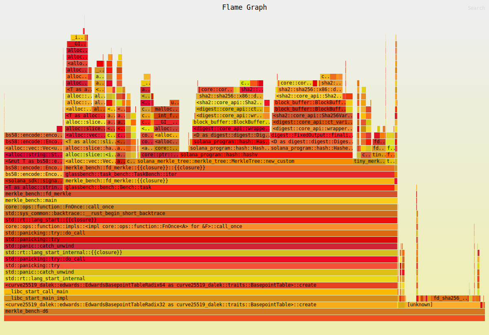

# Benchmarking Merkle Tree Construction for Receipts

This is a benchmark comparing merkle tree construction for receipts(Signature + Status). We are using two libraries for the comparison.

- [Solana-Merkle-Tree](https://crates.io/crates/solana-merkle-tree)
- [Firedancer bmtree32](https://github.com/firedancer-io/firedancer/tree/main/src/ballet/bmtree)

**Note: bmtree32 is written in pure C. This benchmark currently uses FFI therefore there is a certain performance penalty(due to lack of inlining and optimisation)**

System Info:
```
Rust - rustc 1.70.0 (90c541806 2023-05-31)
GCC - gcc (Ubuntu 12.2.0-17ubuntu1) 12.2.0
Clang - Ubuntu clang version 15.0.7
Linux Kernal - 6.2.0-20-generic
Distro - Ubuntu 23.04
```

### Flamegraph Setup
Refer [these](https://github.com/flamegraph-rs/flamegraph#installation) steps to setup flamegraph generation

If you face permission issues while using linux perf then use
`sudo sysctl -w kernel.perf_event_paranoid=2`

Then run the following command to generate flamegraph.
`CARGO_PROFILE_BENCH_DEBUG=true cargo flamegraph --bench merkle_bench`

## Results

Machine - `Intel i5 12400 w/ 16G Ram`



Flamegraph

